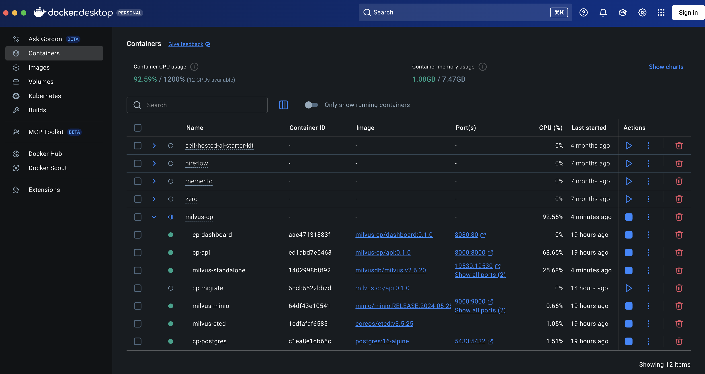

# Operator's manual

A working guide to running this Milvus control plane: what each piece is, who
uses it, how to deploy and configure it, what to do when something breaks, and
how to read every screen it offers.

The [README](README.md) is the overview and quickstart. This is the document you
keep open while operating the thing.

---

## Contents

1. [Who this is for](#1-who-this-is-for)
2. [What the system does](#2-what-the-system-does)
3. [The instances](#3-the-instances)
4. [Deploying](#4-deploying)
5. [Configuring](#5-configuring)
6. [The web interfaces](#6-the-web-interfaces)
7. [Operating it day to day](#7-operating-it-day-to-day)
8. [Incident runbook](#8-incident-runbook)
9. [Workflows the system supports](#9-workflows-the-system-supports)
10. [Interacting programmatically](#10-interacting-programmatically)
11. [What is stored, and for how long](#11-what-is-stored-and-for-how-long)
12. [FAQ and gotchas](#12-faq-and-gotchas)

---

## 1. Who this is for

Four different people touch this system, and they want different things from
it. Most sections below say which of them it is written for.

| Role | What they do here | Mostly uses |
|---|---|---|
| **Deployer / platform engineer** | Stands the stack up, sets `.env`, upgrades versions, tears it down | `deploy.sh`, `make`, `.env` |
| **Operator / on-call** | Watches health, responds when something goes red, diagnoses | Dashboard :8080, `chaos.sh status`, events |
| **Application developer** | Uses Milvus as a vector database from their own app | Milvus gRPC :19530 directly; dashboard to check it is up |
| **Data / ML engineer** | Loads collections, builds indexes, runs searches | `ops/milvus_demo.py`, Milvus WebUI, dashboard collections panel |

A useful distinction: **the control plane is not in the data path.** Application
traffic goes straight to Milvus on :19530. If the control plane is down, your
vector searches keep working — you just lose visibility. That is deliberate, and
it is why the API is safe to restart at any time.

---

## 2. What the system does

**It answers "is my Milvus deployment healthy, and if not, what exactly is
wrong?"** — continuously, and without lying to you when it cannot tell.

Concretely, it:

- **provisions** the whole stack from one command, in a repeatable way;
- **probes** Milvus over gRPC, its Prometheus endpoint, the object store, the
  metadata store and the container runtime, on a schedule;
- **aggregates** those signals into one status by fixed, documented rules;
- **records** a health time series, component state, collection statistics and
  an audit trail of every state change;
- **presents** all of it on one page, and through a documented REST API;
- **degrades honestly** — when a dependency is down you get an explicit "this is
  unavailable, here is the code" rather than an error page or, worse, a stale
  number presented as current.

### What it deliberately does not do

- **It does not proxy or accelerate your queries.** Not in the data path.
- **It does not alert.** It records transitions and exposes them; wiring those to
  a pager is the production step (see the README's limitations).
- **It does not store metrics as a time series.** It scrapes on request. "When
  did goroutines start climbing?" is not answerable here; "when did the cluster
  go unhealthy?" is, from `events`.
- **It does not manage Milvus configuration.** It observes; it does not tune.
- **It does not authenticate anyone.** Anyone who can reach port 8000 has full
  control. Do not expose it.

---

## 3. The instances

Seven containers, all created by one `docker compose` project named
`milvus-cp`. Six run continuously; the seventh is a job that runs once and
exits. Docker Desktop groups them under the project name:

<p align="center">
  <a href="docs/images/docker.png">
    
  </a>
</p>

<p align="center"><sub><em>Click for full size.</em></sub></p>

Three things in that view are worth reading carefully, because each one
regularly gets mistaken for a fault:

- **`cp-migrate` has a hollow circle and a ▷ play button**, while the other six
  have filled green dots and ■ stop buttons. It is **not** broken — it is a
  one-shot job that already ran, exited 0 and is meant to stay exited. Pressing
  play re-runs it; it takes about two seconds and stops again.
- **`cp-api` and `cp-migrate` share one image**, `milvus-cp/api:0.1.0`. That is
  deliberate — the migration code and the application code are the same build,
  so they cannot drift apart. Only the command differs.
- **`cp-postgres` publishes `5433:5432`** on this machine. The left number is
  the host port (`POSTGRES_HOST_PORT`, moved because something local owned
  5432); the right is the in-network port the API uses, which never changes.
  See [§5](#5-configuring).

Everything else is as you would expect: `cp-dashboard` on `8080:80`, `cp-api` on
`8000:8000`, `milvus-standalone` on `19530` plus a second port (`9091`), and
`milvus-minio` on `9000` plus its console on `9001`. `milvus-etcd` publishes
nothing — it is reachable only from inside the compose network.

| Container | Image | Ports (host) | Runs | Purpose |
|---|---|---|---|---|
| `cp-dashboard` | `milvus-cp/dashboard:0.1.0` | 8080 | always | nginx: serves the SPA, proxies `/api` |
| `cp-api` | `milvus-cp/api:0.1.0` | 8000 | always | FastAPI: routes, scheduler, adapters |
| `cp-migrate` | `milvus-cp/api:0.1.0` | – | **once, then exits 0** | `alembic upgrade head` |
| `cp-postgres` | `postgres:16-alpine` | 5432 | always | Control-plane database |
| `milvus-standalone` | `milvusdb/milvus:v2.6.20` | 19530, 9091 | always | The vector database itself |
| `milvus-etcd` | `quay.io/coreos/etcd:v3.5.25` | – | always | Milvus metadata + session leases |
| `milvus-minio` | `minio/minio:RELEASE...` | 9000, 9001 | always | Object store + Woodpecker WAL |

They split into two Compose **profiles**: `infra` (the bottom four) and `app`
(the top three). `--profile infra` alone is useful when you want to run the API
from your host against containerised infrastructure.

### `cp-dashboard` — the operator's screen

nginx serving a React single-page app and reverse-proxying `/api/` to `cp-api`.
One origin, so there is no CORS setup and the browser only needs port 8080.

- **Consumers:** operators, on-call, anyone who wants a glance.
- **Health:** `GET :8080/nginx-health` — answers from nginx itself, so a
  `cp-api` outage does not make the dashboard look unhealthy (it shows a red
  banner instead, which is the point).
- **Depends on:** `cp-api` being *resolvable* at start (nginx needs DNS).

### `cp-api` — the control plane

The FastAPI service. Contains the REST API, three scheduled jobs and every
adapter (Milvus, Docker, Prometheus, MinIO, etcd).

- **Consumers:** the dashboard, `smoke_test.sh`, `seed_cluster.sh`, you via
  `curl`, and anything else you point at the API.
- **Health:** `GET :8000/healthz` (liveness, touches nothing) and
  `GET :8000/readyz` (readiness, 503 only if PostgreSQL is unreachable).
- **Restart safety:** completely safe. State lives in PostgreSQL; the scheduler
  picks straight back up. It survives PostgreSQL restarts without restarting
  itself.
- **Mounts the Docker socket read-only** — see the security note in
  [ARCHITECTURE.md](docs/ARCHITECTURE.md). It is root-equivalent. Do not run
  this on a shared host.

### `cp-migrate` — the schema job

Runs `alembic upgrade head`, exits 0, stays exited. **That is the correct
resting state.** `cp-api` will not start until it has exited successfully.

- Sharing the API image is deliberate: the migration code is the same build as
  the application code, so they cannot drift apart.
- Pressing "play" in Docker Desktop re-runs it. It is idempotent — about two
  seconds and back to exited 0.
- It carries no `com.milvus-cp.component` label, so it does **not** appear in
  the dashboard's components table. A finished deploy step shown as a red
  "exited" row reads as a fault every time someone looks.
- This is why `docker ps -a` shows 7 but the dashboard says 6/6.

### `cp-postgres` — the control-plane database

Stores registered clusters, the health time series, component and collection
snapshots, and the event trail. **Nothing Milvus needs is in here** — losing it
costs you history and the API's metadata routes, not your vectors.

- **Consumers:** `cp-api` only.
- **Host port** is publish-only, for `psql` and Alembic from your machine. The
  API always reaches it on 5432 inside the network.

### `milvus-standalone` — the vector database

The actual product. Five internal roles in one process (root/data/query/index
coordination plus a proxy and an embedded streaming node).

- **Consumers:** your applications, on **:19530 (gRPC)** — directly, not through
  the control plane. Plus `ops/milvus_demo.py`, and `cp-api` for probing.
- **:9091** serves `/healthz`, `/metrics` and the WebUI.
- **Slow to start:** 90–120 s on first boot. The healthcheck allows for it.
- **Fragile about its dependencies** — see [§8](#8-incident-runbook). It exits
  ~26 s after losing etcd, and does not survive a long `docker pause`.

### `milvus-etcd` — Milvus's metadata store

Collection schemas, segment assignments, the timestamp allocator, and the
session leases that keep Milvus's internal nodes registered.

- **Consumers:** Milvus, and the control plane's health probe.
- **Not exposed to the host.** Reach it from inside the network, e.g.
  `docker exec cp-api curl -s http://milvus-etcd:2379/health`.
- **Losing it is fatal to Milvus within about half a minute.** This is the
  dependency worth protecting first in any real deployment.

### `milvus-minio` — object store and WAL

Segment data *and* the Woodpecker write-ahead log. In Milvus 2.6 the object
store is on the write path, which is why there is no Pulsar or Kafka here.

- **Consumers:** Milvus; the control plane's signed S3 probe; you, via the
  console on :9001.
- **Losing it:** reads from already-loaded collections keep working, **writes
  fail**. Milvus's own `/healthz` keeps returning 200 throughout — which is
  exactly why the control plane probes the bucket directly.

---

## 4. Deploying

*For the deployer.*

### First deployment

```bash
cp .env.example .env      # review it — see §5
make up                   # preflight → start → wait healthy → bucket → migrate → register
```

`make up` is idempotent. Running it again on a healthy stack is a no-op that
re-verifies everything, so it is always safe as a "make sure it's all up".

Expect **~2 minutes** the first time (image pulls plus Milvus first boot), and
under a minute after that.

If preflight fails it names the reason — insufficient Docker memory, a taken
port, missing Compose v2. Fix and re-run; nothing is left half-created.

### Verifying a deployment

```bash
make status         # container health + live endpoint probes + row counts
make smoke          # 72 assertions across every endpoint
make demo           # end-to-end: create, insert 5k rows, index, load, search
```

If all three pass, the deployment is good.

### Profiles

```bash
./infra/deploy.sh up --profile all     # everything (default)
./infra/deploy.sh up --profile infra   # just etcd, MinIO, Milvus, PostgreSQL
```

`--profile infra` is for developing the control plane itself: run the API from
your host against the containerised infrastructure. You then need host-visible
endpoints:

```bash
cd control_plane
POSTGRES_HOST=localhost POSTGRES_PORT=5433 \
MILVUS_URI=http://localhost:19530 MILVUS_METRICS_URI=http://localhost:9091 \
  .venv/bin/uvicorn app.main:app --reload
```

> **Watch out:** a cluster registered while the API ran on your host stores
> `endpoint_uri = http://localhost:19530`, which does not resolve from inside a
> container. `make seed` warns you if the registered endpoint does not match the
> current deployment, and tells you the `PATCH` to fix it.

### Upgrading a component

Image versions are pinned in `.env`. To move Milvus:

```bash
# 1. edit MILVUS_VERSION in .env
make down                      # containers go, volumes stay
make up                        # pulls the new tag, restarts, re-runs migrations
make smoke && make demo        # verify
```

After a Milvus upgrade, **check the metrics panel**. Milvus renames metric
families between minor versions; anything renamed shows up as a greyed tile
with "not exposed by this version", and the API logs the full list of missing
names once at startup:

```bash
docker logs cp-api | grep metrics_allowlist_gaps
```

That is the signal to update `app/adapters/metric_allowlist.py`.

### Teardown

```bash
make down       # stop containers, KEEP all data
make destroy    # stop containers AND delete every volume (prompts first)
```

| | `down` | `destroy` |
|---|---|---|
| Containers, network | removed | removed |
| Milvus collections and vectors | kept | **gone** |
| Control-plane history and events | kept | **gone** |
| Built images | kept | kept |

`make down && make up` resumes exactly where you left off.

---

## 5. Configuring

*For the deployer.* Everything lives in `.env` at the repo root. It is
gitignored; `.env.example` is the template and contains no real secrets.

Changes take effect on `make up` (or `make down && make up` for anything that
alters a container's definition).

### Identity and versions

| Key | Default | Change when |
|---|---|---|
| `COMPOSE_PROJECT_NAME` | `milvus-cp` | Running two stacks on one host |
| `DOCKER_VOLUME_DIRECTORY` | `./volumes` | Data should live elsewhere on disk |
| `MILVUS_VERSION` | `v2.6.20` | Upgrading Milvus — re-check the metrics allowlist |
| `ETCD_VERSION` | `v3.5.25` | Matching an upstream-validated pair |
| `MINIO_VERSION` | `RELEASE.2024-…` | Upgrading the object store |
| `POSTGRES_VERSION` | `16-alpine` | Upgrading the control-plane database |

Everything is pinned deliberately. There is no `:latest` anywhere.

### Credentials and storage

| Key | Default | Notes |
|---|---|---|
| `MINIO_ROOT_USER` / `MINIO_ROOT_PASSWORD` | `minioadmin` | **Change for anything but a laptop.** Used by Milvus *and* by the control plane's probe |
| `MINIO_BUCKET` | `milvus-bucket` | Created by `deploy.sh`; also passed to Milvus so it does not invent its own |
| `POSTGRES_USER` / `_PASSWORD` / `_DB` | `controlplane` | Control-plane database only |

### Networking — the one that trips people up

| Key | Default | Notes |
|---|---|---|
| `POSTGRES_HOST` | `cp-postgres` | The container name. Only change if the API runs outside the network |
| `POSTGRES_PORT` | `5432` | **In-network** port. Leave at 5432 |
| `POSTGRES_HOST_PORT` | `5432` | **Published** port. Change this one on a clash |
| `CP_API_PORT` | `8000` | Published API port |
| `DASHBOARD_PORT` | `8080` | Published dashboard port |
| `MILVUS_URI` | `http://milvus-standalone:19530` | As `cp-api` sees it |
| `MILVUS_METRICS_URI` | `http://milvus-standalone:9091` | As `cp-api` sees it |
| `DOCKER_SOCKET` | `/var/run/docker.sock` | Point at a socket proxy to reduce exposure |

**`POSTGRES_PORT` vs `POSTGRES_HOST_PORT` are deliberately separate.** The first
is how `cp-api` reaches the database *inside* the network and must stay 5432.
The second is only what gets published to your machine. Conflating them means a
host port clash silently rewrites the API's connection string. If something else
owns 5432 (a local PostgreSQL, usually), set `POSTGRES_HOST_PORT=5433` and
nothing else changes.

### Behaviour tuning

| Key | Default | Effect of changing |
|---|---|---|
| `CP_HEALTH_INTERVAL_S` | `15` | How often health is probed. Lower = faster detection, more load |
| `CP_SNAPSHOT_INTERVAL_S` | `60` | Component and collection snapshot frequency |
| `CP_CACHE_TTL_S` | `5` | How long live data counts as fresh. The stale window is derived from it |
| `MILVUS_CONNECT_TIMEOUT_S` | `3` | Deadline for establishing a connection |
| `MILVUS_RPC_TIMEOUT_S` | `5` | Deadline for a call on an established connection |
| `CP_BREAKER_FAIL_MAX` | `3` | Consecutive failures before the breaker opens |
| `CP_BREAKER_RESET_S` | `30` | How long it stays open before a trial call |
| `CP_RETENTION_DAYS` | `7` | Sample retention. Events are kept 4× longer |
| `CP_LOG_LEVEL` | `INFO` | `DEBUG` is genuinely useful; output is JSON either way |

Both timeouts must be **greater than zero**. Zero means "no deadline" in most
clients, which is precisely the hung-dependency failure this system exists to
avoid — so the API refuses to start rather than accept it.

Two extra keys exist with sensible defaults and are not in `.env.example`:
`MINIO_REGION` (`us-east-1`, used to sign the S3 probe) and `ETCD_ENDPOINT`
(`milvus-etcd:2379`).

---

## 6. The web interfaces

Four browser UIs. Each is for a different job.

### 6.1 Control-plane dashboard — http://localhost:8080

**Who:** operators, on-call. **The one to keep on a second monitor.**

One page, refreshed every 5 seconds from a single `/overview` call. It works in
light and dark mode and needs no login.

**Reading it top to bottom:**

**Header and status pill.** Cluster name, deployment type, Milvus version, and
"last checked N s ago" — which counts up between polls, so a frozen number means
the page has lost the API. The pill is the headline:

| Pill | Means | Do |
|---|---|---|
| 🟢 `healthy` | Everything probed and passed | Nothing |
| 🟡 `degraded` | Milvus serves, but something is wrong | Read the banner — see [§8](#8-incident-runbook) |
| 🔴 `unavailable` | Milvus is not reachable | Act now |
| ⚪ `unknown` | Could not evaluate | Look at the API's own logs |

**`unknown` is not a milder `unavailable`.** It means the control plane could
not tell, which is a different problem — usually the API itself is struggling,
not Milvus.

**Connection banner.** Appears only when something is wrong, and stays until it
is not. Each line names the failing area, its **stable error code** and a
message. Search the code, not the prose — `MILVUS_UNREACHABLE`,
`OBJECT_STORE_UNREACHABLE`, `DOCKER_UNAVAILABLE`, `POSTGRES_UNAVAILABLE`,
`BREAKER_OPEN` all mean specific things and all appear in [§8](#8-incident-runbook).

**Cluster metadata card.** Every stored field. This panel reads only from
PostgreSQL, so during a Milvus outage it **stays live while the others dim** —
that contrast is a fast way to tell "Milvus is down" from "the control plane is
down".

**Components table.** One row per expected container: state, health, restart
count, uptime, image. Rows are tinted by state.

> A component that has vanished shows as **`missing`**, not as an absent row.
> An empty row would read as "fine". A red `missing` row reads as "look at me".
> Rising `restart count` on an otherwise-healthy component means something is
> crash-looping — worth catching before it becomes an outage.

**Collections table.** Name, rows, dimension, index type, metric, load state.
Empty state says `no collections — run make demo`.

> A row tagged **`snapshot`** came from the last stored snapshot rather than
> from Milvus just now — meaning Milvus no longer reports it. Usually it was
> deleted; occasionally it means Milvus is not answering properly.
> **`load state`** matters: a collection that is not `Loaded` cannot be searched,
> however healthy everything else looks.

**Metrics panel.** Tiles from the curated allowlist.

> Greyed tiles reading **"not exposed by this version"** are information, not a
> fault. Either the metric needs activity to appear (proxy metrics need traffic;
> entity counts need a loaded collection) or Milvus renamed it in an upgrade.
> The distinction matters: greyed tiles right after a version bump mean the
> allowlist needs updating.

**Log viewer.** Last 100 lines of one component. Pick the component from the
dropdown; lines are tinted by severity and tagged by stream. **Auto-scroll**
can be turned off — it then shows a `paused` badge, so you can read a stack
trace without being yanked to the bottom.

**Events strip.** The last 10 state changes, newest first, colour-coded.

> **This is the panel to point at during an incident.** Rows are written *only
> on transition*, never per poll, so a ten-minute outage produces exactly two
> entries — one going down, one coming back. It reads as a timeline of what
> happened, not a log of what was sampled.

**Stale data is dimmed and stamped.** Any panel showing `as of 12:03:41 (stale)`
is displaying real data that the dependency did **not** confirm on this poll.
Treat the numbers as historical. This is deliberate — an old number rendered as
current is worse than no number.

### 6.2 API documentation — http://localhost:8000/docs

**Who:** developers, and anyone diagnosing via the API.

Swagger UI, generated from the code, with every route carrying a description and
at least one worked example. **"Try it out" executes against the live stack** —
useful, and a reminder that there is no auth.

Start with `GET /api/v1/clusters` to get your cluster id, then paste it into the
other routes. Each route's description explains its degradation behaviour, so
this doubles as the contract reference.

### 6.3 Milvus WebUI — http://localhost:9091/webui/

**Who:** data/ML engineers, and operators diagnosing Milvus itself. This is
Milvus's own console, not part of this project — deeper on Milvus internals than
the dashboard, and blind to everything else.

Verified against this deployment, it surfaces:

| Area | Shows |
|---|---|
| Cluster / nodes | The internal roles and their connections |
| **Dependencies** | **etcd health and the message-queue type** — reports `woodpecker`, confirming no Pulsar |
| Databases, collections | Names, ids, creation time, **in-memory percentage**, whether query service is available |
| Segments, channels, tasks | Per-role detail: compaction, index builds, imports, sync tasks |
| **Slow queries** | Recent slow requests — not surfaced anywhere else |
| Configuration | Milvus's effective runtime configuration |

Reach for it when the control plane says Milvus is degraded and you need to know
*why inside Milvus* — segments not compacting, an index build stuck, a
collection only partly loaded. The in-memory percentage and slow-query list are
the two things it has that nothing else here does.

Its backing API is plain HTTP if you prefer curl:

```bash
curl -s localhost:9091/api/v1/_cluster/dependencies | jq
# {"metastore":{"health_status":true,...,"meta_type":"etcd"},
#  "mq":{"health_status":true,"mq_type":"woodpecker"}}

curl -s localhost:9091/api/v1/_collection/list | jq
curl -s localhost:9091/api/v1/_cluster/slow_query | jq
```

### 6.4 MinIO console — http://localhost:9001

**Who:** operators verifying storage; occasionally data engineers.

Log in with `MINIO_ROOT_USER` / `MINIO_ROOT_PASSWORD` (default
`minioadmin` / `minioadmin`).

Use it to confirm the `milvus-bucket` bucket exists, inspect what Milvus has
written (`files/` holds the Woodpecker WAL; segment data sits alongside), and
check free space. **Do not edit or delete objects** — you are looking at
Milvus's live storage and its WAL, and hand-editing it will corrupt collections.

If the bucket is missing, `make up` recreates it.

---

## 7. Operating it day to day

*For the operator.*

### The 10-second check

Open the dashboard. Green pill, no banner, six components running, "last checked"
counting up — done.

### The 60-second check

```bash
make status        # container health, live probes, row counts
make smoke         # 72 assertions across every endpoint
```

### What actually warrants attention

| Signal | Meaning |
|---|---|
| Pill turns amber or red | Real state change; the banner names the cause |
| A new row in **Events** | Something transitioned. This is the highest-signal thing on the page |
| `restart count` climbing | Crash loop in progress |
| Panels dimmed with `(stale)` | A dependency stopped answering; numbers are historical |
| Tiles greyed after an upgrade | Metric names moved — update the allowlist |
| Collection not `Loaded` | It cannot be searched, whatever else is green |
| "last checked" frozen | The **browser** lost the API — check `cp-api`, not Milvus |

### Useful commands

```bash
./scripts/chaos.sh status                 # containers, health, networks, and the CP's own view
make logs s=milvus-standalone             # tail one service
docker logs cp-api --tail 100             # the control plane's own JSON logs
curl -s localhost:8000/api/v1/events?limit=20 | jq   # recent transitions
```

The API logs one JSON object per line, so `jq` works directly:

```bash
docker logs cp-api 2>&1 | grep health_transition | jq -c '{timestamp, from, to, error_code}'
```

### Routine maintenance

There is almost none. Retention is automatic (daily, 03:17 UTC). Volumes grow
with your data, not with the control plane — the sample tables are pruned.
Check disk occasionally; Milvus segments are the thing that grows.

---

## 8. Incident runbook

*For the operator.* Every code below is what appears in the dashboard banner and
in `degraded_reason.code` from the API. All of these behaviours are drilled and
documented with real output in [RELIABILITY.md](docs/RELIABILITY.md).

### `MILVUS_UNREACHABLE` — cluster red

Milvus is not accepting connections.

```bash
docker ps -a --filter name=milvus-standalone     # is it exited?
docker logs --tail 100 milvus-standalone
docker start milvus-standalone                   # or: ./scripts/chaos.sh recover-all
```

**Most common cause on a laptop:** the host slept. Milvus's etcd session lease
expires while suspended and it shuts down on resume. The logs say so:
`["clock offset is huge…"] [jet-lag=29m58s]` followed by an expired lease.

There is **no `restart:` policy** on the infrastructure tier — deliberately, so
chaos drills stay trustworthy — so Milvus stays down until you start it.
Recovery takes ~30–40 s.

### `MILVUS_TIMEOUT` — cluster red

Milvus accepts TCP but does not answer. It is hung, not gone — a much worse
state, because naive clients hang with it.

The control plane is bounded by design and will not hang. Check container state
(`paused`? OOM?), memory pressure, and Milvus's logs. Note that latency tells
you which deadline fired: ~5 s is the RPC deadline, ~3 s is the connect deadline.

### `OBJECT_STORE_UNREACHABLE` — cluster amber

MinIO is down or the bucket is gone. **Reads from loaded collections keep
working; writes fail.** Milvus's own `/healthz` will still say 200 — that is
exactly why this probe exists.

```bash
docker ps -a --filter name=milvus-minio
docker start milvus-minio        # recovery is ~1 s; Milvus reconnects itself
```

Related codes: `OBJECT_STORE_BUCKET_MISSING` (re-run `make up` to recreate it)
and `OBJECT_STORE_AUTH_FAILED` (credentials in `.env` do not match MinIO's).

### `METADATA_STORE_UNREACHABLE` — cluster amber, **act immediately**

etcd is down. **Milvus exits about 26 seconds later** — it does not degrade
gracefully, because the timestamp allocator lives in etcd and is on the read
path too.

```bash
docker start milvus-etcd
```

You have roughly fourteen seconds of warning between this probe firing and
Milvus dying. If you miss it, start etcd *and* Milvus.

### `POSTGRES_UNAVAILABLE` — metadata routes 503

The control plane's own database. **Milvus is unaffected and your applications
are fine.** You lose history, the events trail and the metadata routes.

```bash
docker start cp-postgres
```

The API **self-heals in about 2 seconds with no restart** — connection pre-ping
discards the dead connections. `/clusters/{id}/health` keeps working throughout,
returning live Milvus data with `cluster: null`, because the endpoint is
resolved from cache.

### `DOCKER_UNAVAILABLE` — cluster amber

The API cannot read the Docker socket. Container state and logs go blank;
everything else works. This is observability loss, not an outage.

On **Linux**, the usual cause is the socket's group. `deploy.sh` handles it; if
you ran `docker compose` by hand:

```bash
DOCKER_GID=$(stat -c '%g' /var/run/docker.sock) docker compose ... up -d
```

On macOS check *Docker Desktop → Settings → Advanced → Allow the default Docker
socket to be used*.

### `BREAKER_OPEN` — cluster red

Not a fault of its own: the circuit breaker tripped after
`CP_BREAKER_FAIL_MAX` consecutive failures and is short-circuiting requests
instead of waiting for timeouts. **The underlying cause is whatever was failing
before it opened** — check `health-history` for the real codes.

It clears itself: after `CP_BREAKER_RESET_S` it allows a trial call, and the
scheduled health job probes regardless, so recovery is noticed without waiting.

### `UPSTREAM_TIMEOUT` on one dashboard panel

A single `/overview` branch exceeded its sub-budget while others succeeded. One
dependency is slow rather than dead. Usually transient; if persistent, find the
slow one via each section's `duration_ms` in the raw `/overview` response.

### Practising

You can rehearse all of this safely:

```bash
./scripts/chaos.sh --help          # every injection
make chaos-milvus                  # stop Milvus and watch the dashboard
make chaos-recover                 # put everything back
```

`chaos.sh` never touches a volume, and `recover-all` is always safe to run.

---

## 9. Workflows the system supports

### Provisioning a Milvus deployment

*Deployer.* One command produces a working, verified stack: preflight →
containers → health gates → object-store bucket → schema migration → cluster
registration → an endpoint summary. Repeatable — `make destroy && make up`
rebuilds from zero, which is how the quickstart in the README was verified.

### Continuous health monitoring

*Automatic.* Every 15 s the control plane probes Milvus (gRPC, deep — not just a
liveness ping), the metrics endpoint, the object store, the metadata store and
the container runtime; applies six fixed rules; writes a `health_checks` row;
and updates the cluster's current status. Nothing to run.

### Incident detection and diagnosis

*Operator.* A state change writes an `events` row within one interval and turns
the dashboard banner red or amber with a stable code. Diagnosis then goes:
banner code → components table → log viewer → `health-history` for the sequence
→ Milvus WebUI if the problem is inside Milvus. [§8](#8-incident-runbook) is the
lookup table.

### Post-incident review

*Operator.* Because events are transition-only, the trail *is* the incident
timeline — no filtering required:

```bash
curl -s 'localhost:8000/api/v1/events?event_type=health_transition&limit=50' \
  | jq -r '.items[] | "\(.created_at)  \(.message)"'
```

Pair it with `health-history` for the per-sample codes and latencies, and you
have when it started, what the error was, how long it lasted and when it
recovered.

### Collection lifecycle management

*Data/ML engineer.* `ops/milvus_demo.py` covers the full lifecycle — schema,
insert, index, load, search — in eleven timed stages, and doubles as a working
reference for pymilvus 2.6. The dashboard's collections panel then tracks row
counts, index type and load state over time, and `collection_snapshots` retains
the history.

### Capacity and drift observation

*Operator.* The metrics panel shows binlog size, segment count, loaded entities,
resident memory, goroutines and open file descriptors. Steadily climbing
goroutines or file descriptors indicate a leak. Note there is **no metric
retention** — for trends over days you need Prometheus (see the README's
production list).

### Audit

*Anyone.* Every cluster registration, health transition, component state change
and breaker event is recorded with a timestamp and a payload, and events are
retained **4× longer** than the sample tables — an audit record that expired with
the routine samples it explains would be useless.

---

## 10. Interacting programmatically

*For developers.* Full reference at http://localhost:8000/docs; the table is in
the [README](README.md#6-api-reference).

```bash
CID=$(curl -s localhost:8000/api/v1/clusters | jq -r '.items[0].id')

curl -s localhost:8000/api/v1/clusters/$CID/health | jq        # live + last stored
curl -s -X POST localhost:8000/api/v1/clusters/$CID/health-check | jq   # force one now
curl -s localhost:8000/api/v1/clusters/$CID/overview | jq      # everything, one call
curl -s "localhost:8000/api/v1/events?limit=20" | jq
```

**Two rules worth knowing when writing a client:**

1. **A read endpoint returning 200 does not mean the dependency is up.** Check
   `live_status` — `ok`, `stale` or `unavailable` — and `degraded_reason.code`.
   Only PostgreSQL produces a 503, and only on metadata routes.
2. **`observed_at` is when the data was true**, not when it was served. If
   `stale` is true, present it as historical.

List endpoints paginate with `limit` (max 500) and `offset`, and return `total`.

### Using Milvus directly

Your application should talk to Milvus, not to this API:

```python
from pymilvus import MilvusClient
client = MilvusClient(uri="http://localhost:19530", timeout=10)
```

The control plane observes that traffic through Milvus's metrics; it does not
mediate it.

---

## 11. What is stored, and for how long

| Table | Contents | Retention |
|---|---|---|
| `clusters` | Registered deployments, current status | Forever (soft-deleted, never removed) |
| `health_checks` | One row per probe — status, latency, error code, per-dependency reachability | `CP_RETENTION_DAYS` (7) |
| `component_status` | One row per component per snapshot | `CP_RETENTION_DAYS` |
| `collection_snapshots` | Per-collection stats over time | `CP_RETENTION_DAYS` |
| `events` | Transitions only — the audit trail | **4 × `CP_RETENTION_DAYS`** (28) |

Purged daily at 03:17 UTC. **No downsampling** — history is exact until the day
it is deleted.

Direct access if you need it:

```bash
docker exec -it cp-postgres psql -U controlplane -d controlplane
\dt
SELECT checked_at, status, error_code FROM health_checks ORDER BY checked_at DESC LIMIT 10;
```

Nothing Milvus needs lives here. Losing this database costs history, not
vectors.

---

## 12. FAQ and gotchas

**`cp-migrate` shows as exited — is that broken?**
No. It is a one-shot job that runs migrations and exits 0. Exited-0 is its
correct resting state. See [§3](#3-the-instances).

**`docker ps -a` shows 7 containers, the dashboard says 6/6.**
Both right. `cp-migrate` is deliberately unlabelled so a finished deploy step
does not appear as a red "exited" row.

**Milvus keeps dying overnight.**
Host sleep expires its etcd session lease. There is no auto-restart policy, on
purpose. `./scripts/chaos.sh recover-all`.

**The dashboard shows data but everything is dimmed.**
A dependency stopped answering and you are seeing the last known good values.
The banner names which one. Numbers are historical.

**Some metric tiles are permanently grey.**
Either the metric needs activity (proxy metrics need traffic, entity counts need
a loaded collection — run `make demo`) or Milvus renamed it. Check
`docker logs cp-api | grep metrics_allowlist_gaps`.

**Can I run two stacks on one machine?**
Yes — change `COMPOSE_PROJECT_NAME` and every published port
(`POSTGRES_HOST_PORT`, `CP_API_PORT`, `DASHBOARD_PORT`, and Milvus/MinIO ports
in the compose file).

**Is it safe to restart `cp-api`?**
Yes, at any time. State is in PostgreSQL and the scheduler resumes. It also
survives PostgreSQL restarts without needing one itself.

**Can I expose this on a network?**
**No.** No authentication, no TLS, default credentials, and a root-equivalent
Docker socket mount. Localhost or a trusted host only. See
[ARCHITECTURE.md](docs/ARCHITECTURE.md) for what production would require.

**Why doesn't it alert me?**
It records transitions and exposes them; it does not page. The `events` table is
deliberately shaped to be an alert source — one row per real change — so a
webhook on insert is the natural next step.

**Where do I change how often it checks?**
`CP_HEALTH_INTERVAL_S` in `.env`, then `make up`.

---

### See also

- **[README.md](README.md)** — overview, quickstart, API table, limitations
- **[docs/ARCHITECTURE.md](docs/ARCHITECTURE.md)** — internals, the degradation
  envelope, the data model, the Docker-socket trade-off
- **[docs/RELIABILITY.md](docs/RELIABILITY.md)** — six failure drills with real
  captured output
- **[docs/AI_USAGE.md](docs/AI_USAGE.md)** — how this was built
