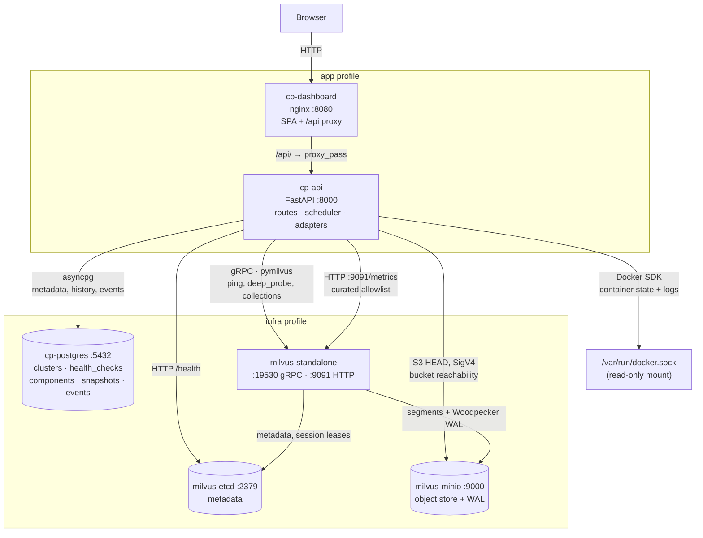
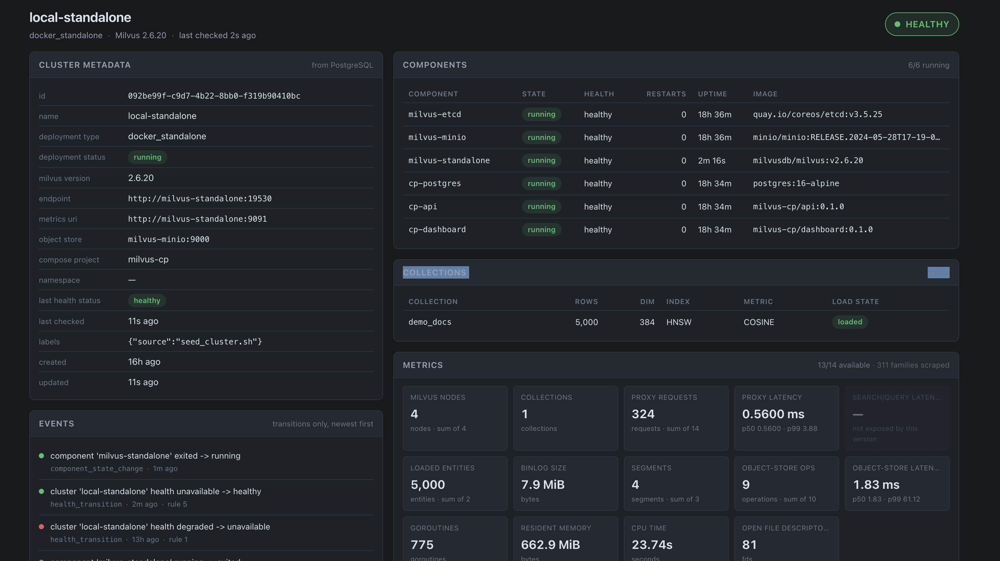
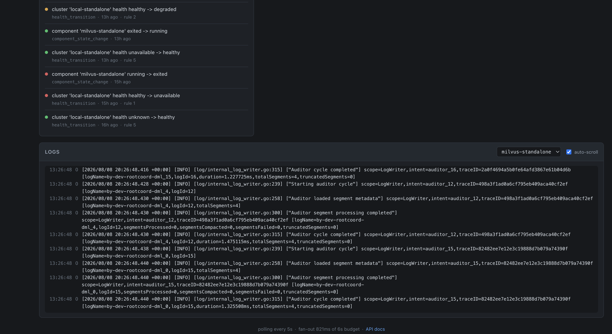

# Milvus 2.6 Control Plane

## 1. What this is

A control plane for a Milvus 2.6 vector-database deployment: it provisions the
stack, watches it, and shows you what it is doing. A FastAPI service registers
clusters in PostgreSQL, probes Milvus over gRPC and Prometheus, reads container
state from the Docker socket, and records every health transition to an audit
trail. A single-page dashboard renders all of it from one aggregate endpoint.

The design premise throughout is that **a monitoring system is judged by how it
behaves when the thing it monitors is broken** — so every read endpoint answers
200 with an explicit "this data is unavailable / stale, and here is why" rather
than a 5xx, and the reliability of that promise is
[drilled and documented](docs/RELIABILITY.md).

> **Deploying or operating this rather than reviewing it?** Go straight to the
> **[Operator's manual](MANUAL.md)** — every container explained, the full
> configuration reference, how to read each of the four web UIs, and an incident
> runbook keyed by error code.

| Service | URL | Notes |
|---|---|---|
| Dashboard | http://localhost:8080 | single page, six panels, polls every 5 s |
| Control-plane API | http://localhost:8000/docs | OpenAPI UI, every route with examples |
| Milvus gRPC | `localhost:19530` | pymilvus target |
| Milvus health / metrics | http://localhost:9091/healthz | shallow liveness; `/metrics` for Prometheus |
| Milvus WebUI | http://localhost:9091/webui/ | Milvus's own diagnostics |
| MinIO console | http://localhost:9001 | `minioadmin` / `minioadmin` |
| PostgreSQL | `localhost:5432` | `controlplane` / `controlplane` |

## 2. Architecture



Two things in that picture are load-bearing and easy to miss.

**The control plane probes etcd and MinIO directly**, not only through Milvus.
It has to: with MinIO stopped, Milvus's own `/healthz` returns 200 *and* a deep
gRPC probe passes, because collection metadata is served from etcd and never
touches object storage. That was measured, not assumed — see
[RELIABILITY.md scenario C](docs/RELIABILITY.md).

**Milvus 2.6 needs no Pulsar or Kafka.** It uses Woodpecker, an embedded WAL
backed by the same object store. That is why the stack is four containers rather
than seven.

### The control-plane app

<p align="center">
  <a href="docs/images/dashboard_top.png">
    
  </a>
  <a href="docs/images/dashboard_bottom.png">
    
  </a>
</p>

<p align="center"><sub><em>Click either image for full size.</em></sub></p>

**Left — the state of the deployment.** Status pill, cluster metadata read from
PostgreSQL, all six components with images and uptimes, the collections table
(`demo_docs`, 5 000 rows, HNSW/COSINE, loaded) and the metric tiles. Note
`13/14 available · 311 families scraped`, with **one tile greyed and labelled
"not exposed by this version"** — that is the design working: a metric the
current Milvus does not emit is shown as a gap rather than hidden.

**Right — what happened, and what it is saying.** The events strip carries only
*transitions*, each stamped with the aggregation rule that fired (`rule 1`
unreachable, `rule 2` degraded, `rule 5` healthy), so it reads as an incident
timeline rather than a poll log. Below it, the log viewer with its component
selector and auto-scroll toggle. The footer reports the `/overview` fan-out
cost against its budget — `fan-out 821ms of 6s budget`.

## 3. Prerequisites

| Requirement | Minimum | Check |
|---|---|---|
| Docker Engine | 24.0 | `docker version` |
| Docker Compose | v2 (plugin) | `docker compose version` |
| Memory allocated to Docker | **8 GB** | Docker Desktop → Settings → Resources |
| Free disk | ~20 GB | `df -h .` |
| Host ports | 5432, 8000, 8080, 9000, 9001, 9091, 19530 | `./infra/deploy.sh preflight` |

`./infra/deploy.sh preflight` checks all of the above and names anything that
fails, so run it first if you are unsure. Nothing else needs installing —
Python, Node and every dependency live inside containers. (A local Python 3.12
venv via `make venv` is optional, and only needed to run the tests or the ops
script from your host.)

## 4. Quickstart

```bash
cp .env.example .env
make up
make demo
open http://localhost:8080
make smoke
```

That is the whole thing. `make up` runs preflight, starts seven containers,
waits for each to report healthy, creates the MinIO bucket, applies migrations
through a one-shot `cp-migrate` service and registers the local cluster.

**Executed verbatim from a destroyed state before submission** (`make destroy`
first). Timings on a 2019 Intel MacBook Pro with images already pulled:

| Step | Result |
|---|---|
| `make up` | **29 s**, 7 containers healthy |
| `make demo` | **9.0 s** — 5 000 rows, HNSW/COSINE index, 5 ranked results |
| dashboard | HTTP 200, six panels populated, `degraded: false`, 14/14 metrics |
| `make smoke` | **72 assertions, 0 failures** |

Allow ~2 minutes for `make up` the first time, when images are being pulled and
Milvus is doing its first-boot initialisation.

Once it is up, **[MANUAL.md](MANUAL.md)** explains what you are looking at:
[the dashboard panel by panel](MANUAL.md#6-the-web-interfaces),
[what to watch](MANUAL.md#7-operating-it-day-to-day), and
[what to do when something goes red](MANUAL.md#8-incident-runbook).

> **One port caveat, hit on the machine this was verified on.** `.env.example`
> publishes PostgreSQL on 5432. If something already owns that port — a local
> PostgreSQL install is the usual culprit — `make up` stops with the exact fix:
> set `POSTGRES_HOST_PORT=5433` in `.env` and re-run. Only the *published* port
> changes; the API still reaches the database on 5432 inside the compose
> network. See [Troubleshooting](#11-troubleshooting).

## 5. Command reference

### `./infra/deploy.sh`

| Subcommand | Does |
|---|---|
| `preflight` | Verify Docker ≥ 24, Compose v2, ~8 GB RAM, 20 GB disk and that every required port is free |
| `up [--profile infra\|all] [--mode standalone]` | Full bring-up: preflight → compose up → wait for health → MinIO bucket → migrations → cluster registration → endpoint summary |
| `status` | Per-service container health, live endpoint probes and control-plane row counts |
| `logs [service] [-f]` | Tail logs; with no service, all of them |
| `restart <service>` | Restart one service and wait for it to be healthy again |
| `down` | Stop and remove containers. **Volumes are kept** |
| `destroy [--yes]` | Remove containers, volumes and `./volumes` on disk. **Destroys all data**; prompts unless `--yes` |
| `reset` | `destroy --yes` then `up` — a clean rebuild from zero |

`--profile infra` brings up only etcd, MinIO, Milvus and PostgreSQL (4
containers), which is useful when running the API from your host for debugging.
`--profile all` (the default) adds `cp-migrate`, `cp-api` and `cp-dashboard`.

### `make`

| Target | Does |
|---|---|
| `up` / `down` / `destroy` | Wrappers over `deploy.sh` |
| `ps` / `status` / `logs` | Stack inspection |
| `migrate` / `migrate-down` | Alembic to head / all the way back |
| `seed` | Verify (or create) the local cluster registration |
| `venv` | Create the Python 3.12 virtualenv and install dependencies |
| `demo` | Run the Milvus operations script end to end |
| `smoke` | Walk every API endpoint, asserting status codes and JSON fields |
| `test` | Unit suite — **no infrastructure needed** |
| `test-integration` | Integration tests against a running stack |
| `test-chaos` | Outage regression test. **Stops and restarts Milvus** |
| `test-all` | Everything, including the destructive drill |
| `chaos-milvus` / `-minio` / `-postgres` / `-etcd` / `-pause` / `-network` | Failure injections |
| `chaos-recover` / `chaos-status` | Restore everything / show current state |
| `dashboard` / `dashboard-build` / `dashboard-test` | Dev server / production build / render tests |
| `fmt` / `lint` | Format and auto-fix / check without modifying |

`./scripts/chaos.sh --help` documents the injections in more detail.

## 6. API reference

Base path `/api/v1`. Full interactive documentation with request/response
examples for every route: **http://localhost:8000/docs**.

| Method | Path | Purpose |
|---|---|---|
| GET | `/healthz` | Liveness of the control plane itself. Touches no dependency |
| GET | `/readyz` | Readiness. 503 only when PostgreSQL is unreachable |
| GET | `/api/v1/clusters` | List registered clusters. `?status=`, `limit`, `offset` |
| POST | `/api/v1/clusters` | Register a cluster. 201, or 409 on a duplicate name |
| GET | `/api/v1/clusters/{id}` | Metadata plus last known health |
| PATCH | `/api/v1/clusters/{id}` | Update mutable fields |
| DELETE | `/api/v1/clusters/{id}` | Soft delete (`deployment_status: deleted`) |
| GET | `/api/v1/clusters/{id}/health` | Live probe plus the last persisted check |
| POST | `/api/v1/clusters/{id}/health-check` | Force a check now and persist it |
| GET | `/api/v1/clusters/{id}/health-history` | Time series from `health_checks` |
| GET | `/api/v1/clusters/{id}/collections` | Live list and stats, merged with the last snapshot |
| GET | `/api/v1/clusters/{id}/collections/{name}` | Schema, index, load state, row count |
| GET | `/api/v1/clusters/{id}/metrics` | Curated runtime metrics from `:9091/metrics` |
| GET | `/api/v1/clusters/{id}/components` | Container state via the Docker SDK |
| GET | `/api/v1/clusters/{id}/logs?component=&lines=&since=` | Recent container logs |
| GET | `/api/v1/clusters/{id}/overview` | The dashboard's single call — concurrent fan-out |
| GET | `/api/v1/events?limit=&cluster_id=` | Incident and audit trail |

### The degradation envelope

Every endpoint mixing stored and live data returns the same shape, whatever
state the dependencies are in:

```jsonc
{
  "cluster": { /* from PostgreSQL, or null if it is down */ },
  "live":    { /* or null when unavailable */ },
  "live_status": "ok" | "stale" | "unavailable",
  "observed_at": "2026-08-08T00:51:28Z",   // when the data was TRUE, not when served
  "stale": false,
  "degraded_reason": null | { "code": "MILVUS_UNREACHABLE", "message": "...", "since": null }
}
```

**A dependency being down never produces a 5xx on a read endpoint.** Only
PostgreSQL can cause a 503, and only on routes that cannot answer without it.

### Examples

Health while everything is fine:

```bash
$ curl -s localhost:8000/api/v1/clusters/$CID/health | jq '{live_status, live: .live.status, rule: .live.rule}'
{
  "live_status": "ok",
  "live": "healthy",
  "rule": 5
}
```

The same call with Milvus stopped — note the **200**:

```bash
$ curl -s -w '\nHTTP %{http_code}\n' localhost:8000/api/v1/clusters/$CID/health \
    | jq -c '{live: .live.status, rule: .live.rule, code: .degraded_reason.code, cluster: .cluster.name}'
{"live":"unavailable","rule":1,"code":"MILVUS_UNREACHABLE","cluster":"local-standalone"}
HTTP 200
```

The incident trail — written **only on transition**, never per poll:

```bash
$ curl -s 'localhost:8000/api/v1/events?limit=3' | jq -c '.items[] | {created_at, event_type, message}'
{"created_at":"2026-08-07T21:46:11Z","event_type":"health_transition","message":"cluster 'local-standalone' health unavailable -> healthy"}
{"created_at":"2026-08-07T21:41:41Z","event_type":"component_state_change","message":"component 'milvus-standalone' running -> exited"}
{"created_at":"2026-08-07T21:40:54Z","event_type":"health_transition","message":"cluster 'local-standalone' health healthy -> unavailable"}
```

## 7. Milvus operations script

`ops/milvus_demo.py` is standalone — it imports nothing from the control plane
and talks only to Milvus, so it can prove a freshly deployed cluster works
before any of the API exists.

```
python ops/milvus_demo.py \
  --uri http://localhost:19530 \
  --collection demo_docs \
  --dim 384 --rows 5000 --batch 1000 \
  --index HNSW --metric COSINE \
  --embedder random|minilm \
  --topk 5 --filter 'category == "tech"' \
  --drop-existing --keep --json-out results.json -v
```

| Option | Default | Notes |
|---|---|---|
| `--uri` | `http://localhost:19530` | The script runs on your host, so `localhost`, not the compose name |
| `--collection` | `demo_docs` | |
| `--dim` | `384` | Forced to 384 by `--embedder minilm` |
| `--rows` / `--batch` | `5000` / `1000` | |
| `--index` | `HNSW` | or `IVF_FLAT`; params and search params vary by type |
| `--metric` | `COSINE` | or `L2`, `IP` |
| `--embedder` | `random` | `random` needs no downloads; `minilm` gives semantically meaningful neighbours |
| `--topk` | `5` | |
| `--filter` | – | e.g. `'category == "tech"'`, backed by an INVERTED scalar index |
| `--query` | – | Query text; only meaningful with `minilm` |
| `--drop-existing` / `--keep` | off | Drop first / do not drop at the end |
| `--json-out` | – | Machine-readable summary, consumed by `smoke_test.sh` |
| `--timeout` | `30.0` | Per-call, seconds |
| `-v` | off | Extra detail per stage |

Exit codes: **0** success, **2** bad arguments, **3** connect failure, **4**
Milvus operation failed.

A real run (`make demo`, trimmed):

```
==========================================================================
 Milvus operations demo — 5,000 rows, HNSW/COSINE, embedder=random
==========================================================================
[ 1/11] connect
        ok   0.03s  Milvus 2.6.20 at http://localhost:19530
[ 2/11] schema
        ok   0.00s  5 fields, vector dim=384, auto_id, dynamic field enabled
[ 3/11] create collection
        ok   0.15s  'demo_docs' created (no index yet)
[ 4/11] generate embeddings
        ok   0.06s  5000 x 384d via random, L2 norm 1.0000-1.0000
[ 5/11] insert
          batch 1/5   1000 rows   0.53s
          ...
        ok   3.45s  5000 rows in 5 batches, 1,447 rows/s
[ 6/11] build index
        ok   2.20s  HNSW/COSINE {'M': 16, 'efConstruction': 200} on vector, INVERTED on category
[ 7/11] load collection
        ok   1.97s  state=Loaded
[ 8/11] search
        ok   0.21s  5 hits in 209.3ms, params={'ef': 64}, query=a random unit vector
[ 9/11] display results

          rank                   id       score  category    text
          ----  -------------------  ----------  ----------  ------------------------------
             1   468229535353015004      0.1693  food        Sourdough bread rises using ...
             2   468229535353015840      0.1606  travel      Booking a window seat on the ...
             3   468229535353014070      0.1596  finance     An index fund tracks a market ...
             4   468229535353015934      0.1469  travel      A layover long enough to leave ...
             5   468229535353014203      0.1431  travel      The night train from Vienna to ...

        ok   0.00s  5 ranked results, query latency 209.3ms
[10/11] stats
        ok   0.01s  row_count=5,000, 5 fields, auto_id=True
[11/11] cleanup
        ok   0.00s  kept 'demo_docs' (--keep)
==========================================================================
 done in 9.04s — 5,000 rows, 5 ranked results
==========================================================================
```

With `--embedder minilm` the neighbours are semantically meaningful; verified by
asking six queries spanning the built-in corpus's six topics, all six of which
retrieved their own topic as the top hit. See
[the platform caveat](ops/requirements.txt) if you are on an Intel Mac.

## 8. Technology choices and trade-offs

| Choice | Why | Trade-off accepted |
|---|---|---|
| **Milvus 2.6.20 standalone** | Woodpecker WAL removes the Pulsar/Kafka dependency: four infra containers instead of seven, and a demo that starts in under a minute | No HA. A single Milvus process is a single point of failure |
| **Docker Compose, two profiles** | `infra` and `app` separate cleanly, so the API can run on the host against containerised infra while debugging | Not production orchestration; no rolling deploys |
| **FastAPI + Pydantic v2** | Async-native, and the response models generate an OpenAPI page good enough to be the demo artifact | — |
| **PostgreSQL + SQLAlchemy 2.0 async + Alembic** | Needed a real relational store for the time series and the audit trail; Alembic makes the schema reviewable as code | An extra container the control plane must itself survive losing |
| **pymilvus, wrapped in `asyncio.to_thread`** | The only first-class Milvus SDK, and it is synchronous | Every call costs a thread; hard deadlines are mandatory, not optional |
| **APScheduler in-process** | Three periodic jobs do not justify a broker and a worker tier | Jobs die with the API; no distributed locking (single replica assumed) |
| **React + Vite + TypeScript, one CSS file** | Types across the API boundary catch envelope mistakes at build time | Hand-written CSS; no component library |
| **nginx serving the SPA and proxying `/api`** | One origin means no CORS and no environment-specific base URL | One more container |
| **Prometheus text scrape, curated allowlist** | Milvus exposes ~400 families; the dashboard needs ~14 | The allowlist drifts across Milvus versions — mitigated by returning absent metrics as `available: false` rather than hiding them |

**Rejected, and why**

- **Kubernetes / the Milvus Operator.** Heavier setup for the same demo surface:
  a reviewer would spend their first ten minutes on a cluster rather than on the
  control plane. The Docker adapter is deliberately behind a `ComponentRuntime`
  interface so a `KubernetesAdapter` is a new file, not a rewrite.
- **A Go or Node backend.** No first-class Milvus SDK. The Python client is the
  one Milvus actually maintains, and fighting a second-class SDK would have cost
  more than `asyncio.to_thread` does.
- **Grafana for the dashboard.** It would have satisfied the requirement with
  far less code — and hidden the API-composition work being evaluated. The
  interesting part is the `/overview` fan-out and the degradation envelope, and
  a Grafana panel pointed at Prometheus demonstrates neither.
- **A heavyweight circuit-breaker library.** Three states and two counters did
  not warrant a dependency; the version here is ~200 lines and emits the
  transition callbacks the events table needs.
- **boto3 / the MinIO SDK** for the object-store probe. One request shape; SigV4
  signing is forty lines of `hmac` and `httpx` was already a dependency.

## 9. Assumptions and known limitations

Stated plainly. None of these are acceptable in production; all are deliberate
for a local demo.

**Scope**
- **Single cluster in practice.** The schema, the API and the adapter registry
  are all multi-cluster (everything is keyed by `cluster_id`, breakers and
  clients are per-endpoint), but one cluster is registered and that is the only
  path exercised.
- **Standalone only — no HA.** One Milvus, one etcd, one MinIO, one PostgreSQL.
  Any of them is a single point of failure, as
  [RELIABILITY.md](docs/RELIABILITY.md) demonstrates rather than claims.
- **`deploy.sh --mode distributed` is not implemented.** It exits with a clear
  message pointing at the docs rather than silently doing something else.
- **Kubernetes support is not built.** Only the interface seam for it exists.

**Security** — see [ARCHITECTURE.md](docs/ARCHITECTURE.md) for the full write-up.
- **No authentication or authorisation on the control plane.** Anyone who can
  reach port 8000 can register, modify and delete clusters.
- **The Docker socket is mounted read-only, and that is still root-equivalent.**
  `:ro` makes the *file* read-only; it does not restrict what may be sent over
  the socket, and anything that can talk to it can start a privileged container
  and own the host.
- **Default credentials** (`minioadmin`, `controlplane`) in `.env.example`. No
  secrets manager. `.env` is gitignored and `.env.example` contains no real
  credentials, but the defaults are the defaults.
- **No TLS anywhere.** All traffic — browser, API, gRPC, S3 — is plaintext.

**Observability**
- **The metrics allowlist may drift across Milvus versions.** It was authored
  against a live 2.6.20 instance, and four names in the original specification
  were already wrong. Absent metrics are returned `available: false` with a
  reason rather than hidden, and the gap is logged at startup — a rename
  degrades a tile instead of silently blanking it.
- **Logs are read from the Docker API, not a log aggregator.** They vanish with
  the container, cannot be searched across services, and are unavailable
  entirely if the socket is not mounted.
- **Retention is time-based with no downsampling.** `health_checks`,
  `component_status` and `collection_snapshots` are deleted after
  `CP_RETENTION_DAYS`; `events` is kept 4× longer. Nothing is rolled up, so
  history is exact until the day it is gone.
- **No metric storage.** The control plane scrapes on request; nothing retains a
  series, so "when did this start?" is only answerable from `health_checks` and
  `events`.

**Operational**
- **The scheduler is in-process and assumes a single replica.** Two API replicas
  would both run the health job. The row lock makes the *event* write safe, but
  the duplicated probing is waste.
- **No `restart:` policy on the infra tier.** Deliberate — an auto-restart would
  silently undo a chaos injection and make the drills untrustworthy. It also
  means a Milvus that dies on its own stays dead until you start it.
- **`docker pause` is not a reversible injection for Milvus.** Past the etcd
  lease TTL it kills the process; `chaos.sh` says so.

## 10. Teardown

```bash
make down       # stop and remove containers. Volumes and ./volumes are KEPT.
make destroy    # the above, plus delete every volume and ./volumes on disk.
```

| | `make down` | `make destroy` |
|---|---|---|
| Containers | removed | removed |
| Compose network | removed | removed |
| `./volumes/{etcd,minio,postgres}` on disk | **kept** | **deleted** |
| Milvus collections and vectors | kept | **gone** |
| Control-plane database (clusters, history, events) | kept | **gone** |
| Built images | kept | kept |
| Prompts before acting | no | **yes**, unless `--yes` |

`make down` then `make up` resumes with all data intact. `make destroy` then
`make up` is a clean-machine rebuild — which is exactly how the
[Quickstart](#4-quickstart) above was verified. To remove the images too:
`docker rmi milvus-cp/api:0.1.0 milvus-cp/dashboard:0.1.0`.

## 11. Troubleshooting

The five failures actually hit while building this. For failures of the *running
system* — keyed by the error code the dashboard shows — see the
[incident runbook](MANUAL.md#8-incident-runbook).

**1. `make up` seems to hang on `waiting for milvus-standalone`.**
Milvus takes roughly 90–120 s on first boot — it initialises etcd metadata,
creates the bucket layout and starts five internal roles. The healthcheck has a
120 s `start_period` for that reason. `deploy.sh` prints a progress dot per
second and, on timeout, dumps the last 50 log lines of the failing container. If
it genuinely times out, `make logs s=milvus-standalone` is the next step.

**2. `port 5432 was taken between preflight and startup`.**

```
Error response from daemon: ports are not available: exposing port TCP 0.0.0.0:5432
[fail] port 5432 was taken between preflight and startup
       Identify it:  lsof -nP -iTCP:5432 -sTCP:LISTEN   (may need sudo)
       Either disable that unit, or publish elsewhere via .env
       (e.g. POSTGRES_HOST_PORT=5433).
```

A local PostgreSQL is the usual cause, and on macOS a launchd unit with
`KeepAlive` will restart within seconds of being stopped — which is why
preflight can pass and the bind still fail. Fix: set `POSTGRES_HOST_PORT=5433`
in `.env` and re-run. Only the *published* port changes; the API still reaches
the database on 5432 inside the compose network. The same applies to 9000, 9091,
19530 and 8080.

**3. Milvus exits on its own, `Exited (1)`, usually after the laptop slept.**

```
["clock offset is huge, check network latency and clock skew"] [jet-lag=29m58s]
[ERROR] ["confirm the lease is expired, the session is expired..."]
```

Suspending the host freezes Milvus's etcd session keepalive; the lease expires
and Milvus shuts down when it resumes. There is no `restart:` policy on the
infra tier — on purpose, so the chaos drills stay trustworthy — so it needs
`docker start milvus-standalone` or `./scripts/chaos.sh recover-all`.

**4. Docker runs out of memory, or Milvus is killed with exit code 137.**
Milvus alone wants ~4 GB. Give Docker at least 8 GB (Docker Desktop → Settings →
Resources → Memory) and re-run `./infra/deploy.sh preflight`, which checks this
and fails with the current allocation. Exit code 137 is the OOM killer.

**5. The components panel is empty and every component shows `DOCKER_UNAVAILABLE`.**
The API runs as a non-root user (uid 10001) and the socket is mode 0660 owned by
root, so the container needs the socket's *group*. `deploy.sh` resolves the
right GID per platform and exports `DOCKER_GID`; if you invoke `docker compose`
directly on **Linux**, set it yourself:

```bash
DOCKER_GID=$(stat -c '%g' /var/run/docker.sock) docker compose ... up -d
```

On macOS the correct value is `0`, which is the default. On Docker Desktop also
check *Settings → Advanced → Allow the default Docker socket to be used*.

**Bonus: the MinIO bucket is missing.** `deploy.sh up` creates it with `mc`, and
Milvus is configured with `MINIO_BUCKET_NAME` so it uses that bucket rather than
its own default. If collections fail to flush and Milvus logs
`failed to create lock object files/wp/...`, the object store is unreachable or
the bucket is gone; re-running `make up` recreates it.

## 12. AI usage

This project was built with AI assistance. What it drafted, what I designed,
what it got wrong and how everything was verified is written up honestly in
**[docs/AI_USAGE.md](docs/AI_USAGE.md)**.

---

### Further reading

- **[MANUAL.md](MANUAL.md)** — the operator's manual: every component and who
  uses it, deployment and configuration reference, all four web UIs explained,
  an incident runbook, and the workflows the system supports.
- **[docs/ARCHITECTURE.md](docs/ARCHITECTURE.md)** — component responsibilities,
  the degradation envelope, the data model, the metrics allowlist provenance and
  the Docker-socket security trade-off.
- **[docs/RELIABILITY.md](docs/RELIABILITY.md)** — six failure injections with
  real captured output, MTTRs, and the three bugs the drills found.
- **[docs/AI_USAGE.md](docs/AI_USAGE.md)** — AI usage, honestly.
